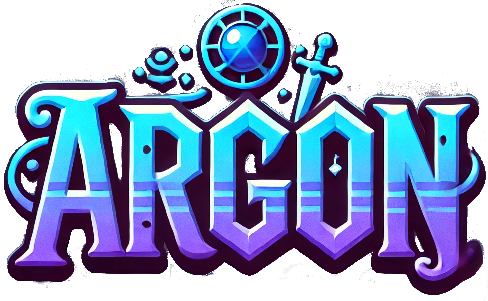

# General

This is a [NX](https://nx.dev/) && [Next.js](https://nextjs.org) project.

## Getting Started

First, run the development server:

```bash
npm nx run argon:dev
# or
yarn nx run argon:dev
# or
pnpm nx run argon:dev
```

Open [http://localhost:3000](http://localhost:3000) with your browser to see the result.


## DEV - NOTES

### Prisma client generation
The command `generate-client` in package.json call the command `argon:generate-client` defined in the project.json.
When running with `nx run`, `.env` file are automatically loaded by NX
(https://nx.dev/recipes/tips-n-tricks/define-environment-variables).
This allow use to define a specific `.env` file for each backend project.

### Prisma schema generation
The command `generate-schema` in package.json call the command `argon:generate-schema` defined in the project.json.
When running with `nx run`, `.env` file are automatically loaded by NX
(https://nx.dev/recipes/tips-n-tricks/define-environment-variables).
This allow use to define a specific `.env` file for each backend project.

### Prisma migration

In order to run 'prisma migration dev', we need to connect to the DB as root (on the local database)
Otherwise, we got this error :
```
Error: P3014
Prisma Migrate could not create the shadow database. Please make sure the database user has permission to create databases. Read more about the shadow database (and workarounds) at https://pris.ly/d/migrate-shadow
Original error: Error code: P1010
User `db_user` was denied access on the database `dbArgon`
```


### Troubleshooting
Add Shadcn/ui component into NX library :
https://github.com/shadcn-ui/ui/issues/778